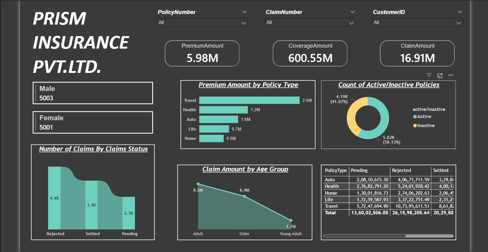
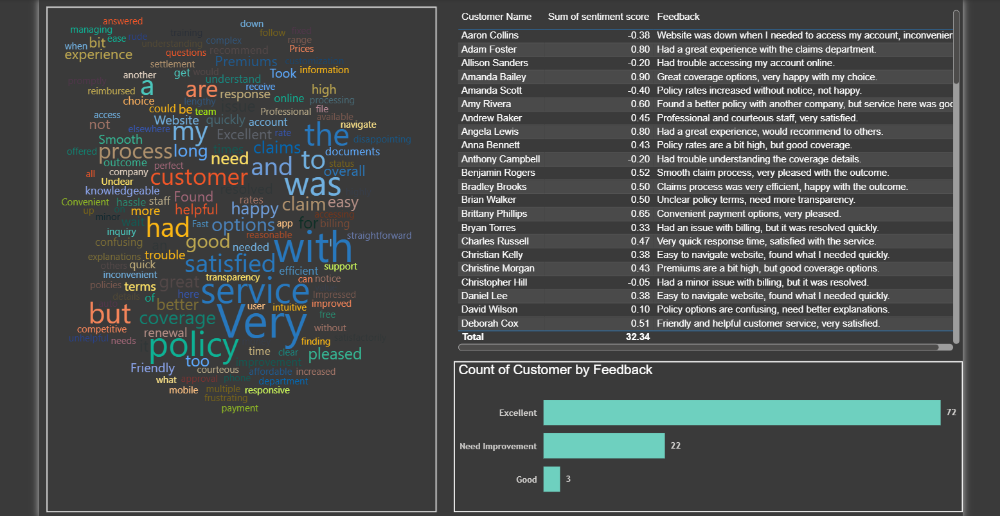

# 📊 Insurance Data Analysis & Customer Feedback Insights
(SQL Server + Power BI + Sentiment Analysis)

📌 Project Overview

This project delivers a comprehensive Insurance Data Analysis Dashboard combined with Customer Feedback Sentiment Analysis, built using Microsoft SQL Server (MSSQL) and Power BI.

It provides deep insights into:

Policy performance

Claims behavior

Customer demographics

Customer satisfaction using sentiment scoring

This is a complete end-to-end data analytics project, covering data storage, transformation, analysis, and visualization.

🎯 Objectives

Analyze insurance policies, claims, and financial metrics

Track premium, coverage, and claim amounts

Understand claim status distribution (Pending, Settled, Rejected)

Identify trends across age groups and policy types

Perform sentiment analysis on customer feedback

Measure customer satisfaction and experience

🏗️ Project Workflow
1️⃣ Data Collection

Insurance dataset (CSV format)

Customer feedback data

2️⃣ Data Storage (SQL Server)

Imported dataset into MSSQL

Created structured tables

Performed initial data validation

3️⃣ Data Transformation

Cleaned and formatted data

Created calculated columns

Prepared sentiment score field

4️⃣ Data Analysis

SQL queries for aggregation and insights

DAX measures for KPIs and metrics

5️⃣ Data Visualization (Power BI)

Built interactive dashboards

Used slicers, charts, and KPIs

Implemented dynamic visuals and filtering

📂 Dataset Description
🔹 Insurance Data

Policy Number

Claim Number

Customer ID

Policy Type (Travel, Health, Auto, Life, Home)

Premium Amount

Coverage Amount

Claim Amount

Claim Status (Pending, Settled, Rejected)

🔹 Customer Data

Gender

Age Group

🔹 Feedback Data

Customer Name

Feedback Text

Sentiment Score (-1 to +1)

🛠️ Tools & Technologies Used

Microsoft SQL Server (MSSQL) – Data storage & querying

Power BI – Dashboard creation & visualization

SQL – Data extraction and aggregation

DAX – Measures and calculated fields

CSV Dataset – Raw data source

📊 Dashboard Features
🔹 KPI Cards

💰 Premium Amount: 5.98M

🛡️ Coverage Amount: 600.55M

📉 Claim Amount: 16.91M

🔹 Visualizations
📌 Policy & Financial Analysis

Premium Amount by Policy Type

Coverage vs Claims comparison

Policy distribution across categories

📌 Claims Analysis

Number of Claims by Status (Rejected, Settled, Pending)

Claim Amount by Age Group

Claims breakdown by policy type

📌 Customer Demographics

Gender distribution (Male vs Female)

Age group segmentation

🔹 Sentiment Analysis (Customer Feedback)

Word Cloud of customer feedback

Sentiment Score per customer (-1 to +1)

Feedback classification (Excellent, Good, Need Improvement)

Customer satisfaction distribution

💡 Key Insights

Travel insurance generates the highest premium revenue

Majority of policies are active (~58%)

Rejected claims are significantly high and need attention

Adults contribute the highest claim amount

Smokers/health-related policies show higher costs (if applicable)

Customer feedback is largely positive, but improvement areas exist

Negative sentiment is linked to:

Claim delays

Website issues

Policy transparency

📸 Dashboard Preview
🔹 Main Dashboard

🔹 Customer Feedback Analysis

🚀 How to Use
🔹 SQL Setup

Import CSV dataset into SQL Server

Create database and tables

Run queries for analysis

🔹 Power BI

Open .pbix file

Connect to SQL Server

Refresh data

Use slicers and visuals to explore insights

